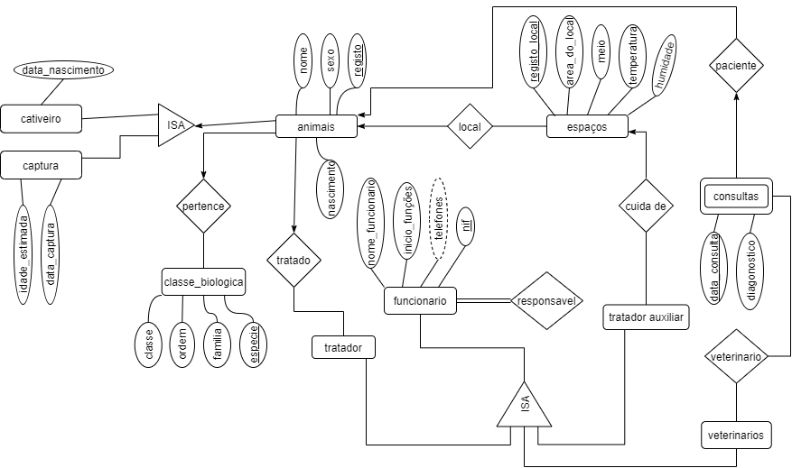

# Resolução do trabalho de Base  de Dados
>**1.**  Para o problema acima, construa um diagrama Entidade-Relação que descreva a informação.  No diagrama não se esqueça de indicar as restrições das relações e as chaves primárias das entidades.  

>>>`Em captura falta o atributo local_captura`  

>**2.**  Transforme  o  modelo  E-R  em  tabelas.   Nas  tabelas  não  se  esqueça  deindicar as chaves primárias e as chaves candidatas.  
- **animais**(nome, sexo,*registo*, local)
- **classe_biologica**(class, ordem, familia, especie,*registo*)
- **cativeiro**(data_nascimento,*registo*,registo_mae,registo_pai)
- **captura**(local_captura,data_captura,idade_estimada,  *registo*)
- **espacos**(*registo_local*area_local,meio,temperatura)
- **funcionario**(nome_funcionario, inicio_funçoes,funço,*nif*)
- **telf_funcionario**(*nif,telemovel*)
- **tratador**(*nif*,animal)
- **tratador_auxiliar**(*nif,local*)
- **veterinarios**(*nif*)
- **consultas**(nif_vet, registo, *data_consulta*, diagonostico,local)

>  **3.**  Defina o conjunto de dependências funcionais que a base de dados deve verificar. Exemplo,  as  seguintes  dependências  funcionais  devem-se  verificar  neste domínio:

>- família→ordem
>- ordem→classe
  
- nome → sexo
- sexo → registo
- registo → local
- classe → ordem
- ordem → familia
- familia → especie
- especie → registo
- registo_pai → registo_mae
- registo_ mae → registo
- registo → data_nascimento
- local_captura → data_captura
- data_captura → idade_estimada
- idade_estimada → registo
- registo_local → area_do_local
- area_do_local → meio
- meio → temperatura
- temperatura → humidade
- nome_funcionario → inicio_funçoes
- inicio_funçoes → telefone
- telefone → telemovel
- telemovel → função
- função → nif
- nif_responsavel → nif
- nif_tratador → registo
- nif_auxiliar → registo_local
- nif_vet → registo
- registo → data_consulta
- data_consulta → diagnostico
- diagnostico → local

> **4.** Apresente a Base de Dados na forma normal de Boyce Codd, BCNF.

>**5.**  Indique justificando se a sua base de dados tem informação redundante.

>**6.**  Indique  se  a  base  de  dados  que  apresentou  na  forma  normal  de  BoyceCodd preserva as dependências.

>**7.**  Para cada relação da base de dados na BCNF indique as chaves primárias,candidatas e estrangeiras.  

> **8.**  Indique os comandos SQL para a criação das tabelas que constituem esta base de dados.  E construa esta base de dados no Postgres.

## [Resolução](Resposta8.md) 
> **9.**  Indique as expressões em SQL para inserir a seguinte informação na suabase de dados e inseria-a.  

## [Resolução](Resposta9.md)  
>**10.**  Indique a expressão em SQL para responder às seguintes perguntas (no relatório indique também o resultado;  

## [Resolução](Resposta10.md) 