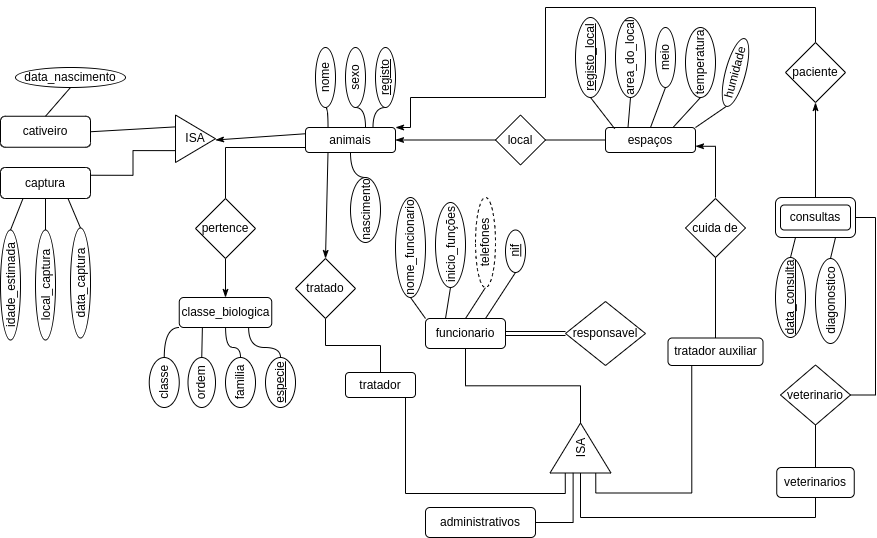

## Resolução do trabalho de Base  de Dados
<input type="checkbox" checked>  01
<input type="checkbox" checked>  02
<input type="checkbox" checked>  03
<input type="checkbox" checked>  04
<input type="checkbox" checked>  05
<input type="checkbox" checked>  06
<input type="checkbox" checked>  07
<input type="checkbox" checked>  08
<input type="checkbox" checked>  09
<input type="checkbox" checked>  10  

---  

>**1.**  Para o problema acima, construa um diagrama Entidade-Relação que descreva a informação.  No diagrama não se esqueça de indicar as restrições das relações e as chaves primárias das entidades.  

  

>**2.**  Transforme  o  modelo  E-R  em  tabelas.   Nas  tabelas  não  se  esqueça  deindicar as chaves primárias e as chaves candidatas.  
- **animais**(*registo*, nome, sexo, local)
- **classe_bio**(*especie*, classe, ordem, familia, registo)
- **captura**(*registo*, local_captura, data_captura, idade_estimada)
- **cativeiro**(*registo*, registo_mae, registo_pai,data_nascimento)
- **espacos**(*registo_local*, area, meio, clima)
- **funcionario**(nome_func, inicio_func, *nif*)
- **telf_funcionario**(*nif, telemovel*)
- **responsavel**(nif_responsvel, *nif_funcionario*)
- **tratador**(nif, animal)
- **tratador_auxiliar**(nif, registo_local)
- **veterinarios**(*nif*)
- **consultas**(nif, registo, registo_local, data_consulta, diagonostico)

>  **3.**  Defina o conjunto de dependências funcionais que a base de dados deve verificar. Exemplo,  as  seguintes  dependências  funcionais  devem-se  verificar  neste domínio:
>- local→tratador_auxiliar
>- animal→tratador
>- espécie→família
>- família→ordem
>- ordem→classe
  
- animal→registo
- animal→tratador
- espécie→família
- família→ordem
- ordem→classe
- local→tratador_auxiliar
- funcionario→responsavel
- funcionario→nif
- funcionario→telefones  
- consulta→veterinario
- consulta→animal
- consulta→local

> **4.** Apresente a Base de Dados na forma normal de Boyce Codd, BCNF.
> 
- registo→ nome, sexo, local
- registo, especie→classe, ordem, familia
- registo→ local-captura,data_captura,idade_estimada
- registo→ registo_mae,registo_pai,data_nascimento
- registo_local→ area, meio, clima
- nif→ nome_func, inicio_func
- nif_funcionario→ nif_responsavel
- animal→ nif
- registo, data_consulta→ nif, registo_local, diagonostico

>**5.**  Indique justificando se a sua base de dados tem informação redundante.

>**6.**  Indique  se  a  base  de  dados  que  apresentou  na  forma  normal  de  BoyceCodd preserva as dependências.

>**7.**  Para cada relação da base de dados na BCNF indique as chaves primárias,candidatas e estrangeiras. 

> **8.**  Indique os comandos SQL para a criação das tabelas que constituem esta base de dados.  E construa esta base de dados no Postgres.

## [Resolução](Resposta8.md) 
> **9.**  Indique as expressões em SQL para inserir a seguinte informação na suabase de dados e inseria-a.  

## [Resolução](Resposta9.md)  
>**10.**  Indique a expressão em SQL para responder às seguintes perguntas (no relatório indique também o resultado;  

## [Resolução](Resposta10.md) 
